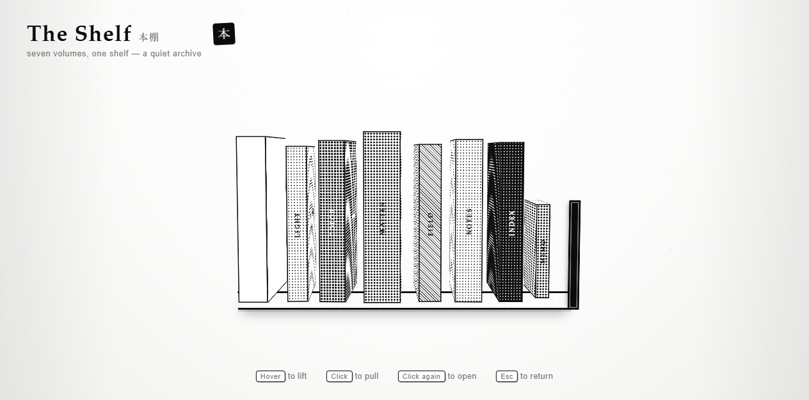

# The Shelf · 本棚



一个「可以从书架上取下来」的交互式网站：一座书架、七卷书，外加一本小书。**日本黑白漫画风格** —— 白纸底、网点（halftone screentone）灰阶、粗墨线描边，抽出书时背后有速度线（集中线）。零依赖，直接放在 GitHub Pages 上就能跑。

内容全部用 **Markdown 文件**维护：一本书 = 一个或多个 `.md` 章节文件，翻开书就是渲染好的页面。

## 交互

- **悬停** — 书轻轻抬起。
- **点击** — 把书从书架抽出，转向你（背后出现速度线）。
- **再点一下** — 翻开封面，看到章节正文。
- **点空白处 / 按 Esc** — 把书放回书架。
- **键盘** — `Tab` 选择一本书，`Enter` 激活。

## 运行

需要一个本地静态服务器（因为浏览器不允许 `file://` 直接读取本地 `.md` 文件）。任选其一：

```sh
# 方式一：Python
python -m http.server 8000
# 打开 http://localhost:8000

# 方式二：Node
npx serve .
```

部署到 GitHub Pages：仓库 Settings → Pages → 选分支和 `/ (root)` 即可，无需任何 CI，`.md` 文件会自动加载。

## 加你的个人记录（Markdown 文件）

所有内容在 `content/` 文件夹里：

```
content/
├── books.json      ← 书单（每本书的元数据 + 章节文件列表）
├── form.md         ← 每本书的章节，一个 .md 就是一个章节
├── index-1.md      ← 一本书可以有多个章节
├── index-2.md
└── ...
```

### 加一个章节

在 `content/` 里新建一个 `.md` 文件，然后在 `content/books.json` 里，把文件路径加到对应书的 `chapters` 数组里即可：

```json
{
  "id": "diary", "spine": "記", "title": "某年某月",
  "material": "tone-50", "ink": "#ffffff", "thick": 46, "h": 340, "w": 230,
  "chapters": ["content/diary-1.md", "content/diary-2.md"]
}
```

每个 `.md` 章节就是纯 Markdown，翻开书后渲染，多个章节之间自动加分隔符，正文太长自动滚动。

支持的语法：`# 标题`、`- 列表`、`1. 有序列表`、`[文字](网址)` 链接、`` 图片（自动转黑白）、`**加粗**`、`*斜体*`、`` `代码` ``、`> 引用`、`---` 分隔线。

### 加一整本书

1. 在 `content/` 新建章节 `.md` 文件；
2. 在 `books.json` 的 `books` 数组里加一个对象，填好字段 + `chapters`。

### 字段说明（books.json 里每本书）

| 字段 | 含义 |
| --- | --- |
| `id` | 唯一标识（英文/拼音） |
| `spine` / `title` | 书脊大字 / 封面标题（可直接写中文） |
| `chapters` | 章节 `.md` 文件路径数组 |
| `notes` | （可选）内页底部标签条 |
| `material` | 网点密度：`solid` `tone-15` `tone-30` `tone-35` `tone-50` `tone-70` `hatch`（越靠后越深） |
| `ink` | 封面文字颜色：深色书用 `#ffffff`，浅色书用 `#111111` |
| `thick` / `h` / `w` | 书的厚度 / 高 / 宽（px） |
| `lean` | 静置倾斜角度 |
| `small` / `tape` | `true` 画成小书 / 加胶带 |

## 技术

| 部分 | 实现 |
| --- | --- |
| 结构 | 原生 HTML + 语义化标签 |
| 内容 | `content/books.json` + `content/*.md`，内置迷你 Markdown 渲染器 |
| 加载 | `fetch` 读取章节，无需任何库、无需构建 |
| 3D | CSS `transform-style: preserve-3d`，每本书是一个 3D 盒子 + 铰链封面 |
| 动画 | CSS `transition`（贝塞尔缓动），无 GSAP |
| 材质 | 黑白网点（halftone）、斜线、粗墨线描边，纯 CSS 渐变，无外部图片 |
| 速度线 | 抽出书时背后的 `repeating-conic-gradient` 集中线 |
| 降级 | `prefers-reduced-motion`；小于 720px 自动切换为 2D 书单 |

## 文件

```
paper-shelf/
├── index.html      页面结构（不用改）
├── content/
│   ├── books.json  ★ 书单
│   └── *.md        ★ 章节（只改这两个）
├── styles.css      样式
├── script.js       加载 + Markdown 渲染 + 交互
└── docs/preview.png
```

## 布局

- 桌面优先，3D 书架会随窗口等比缩放。
- 窄屏（< 720px）自动降级为一张干净的黑白 2D 书单，点击展开正文。
- 无后端、无数据库、无账号、无 API key。
